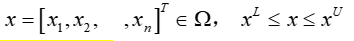
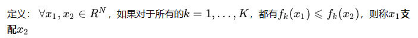

# 一、多目标优化问题介绍

在实际问题中，经常会遇到需要在使多个目标在给定区域上尽可能最佳的优化问题。例如设计一辆车，既要安全（重量大），又要经济（油耗小）。这种多于一个目标函数在给定区域上的最优化问题就称为多目标优化问题（multiobjective optimization）。

多目标优化问题的数学模型可以表述为：

- 目标函数（objective functions）
- 
- 决策变量（decision variables）
- 
- 等式约束或不等式约束（equality constraints or inequality constraints ）
- 

# 二、多目标优化的解集：解集定义

不同于单目标优化，在多目标优化中，各目标之前是相互冲突的，导致不一定存在所有目标都是最优的解。某个解可能在一个目标上是最优的但在另一个上是最差的。（判断多目标优化的关键）

例如：要使汽车安全性高，必然重量大，从而油耗高，经济性差；要使汽车经济好，油耗小，必然要求重量轻，从而安全性低。

因此，多目标优化问题通常存在一个解的集合，它们之间不能简单地比较好坏，这样的解称为非支配解（有效解）或Pareto最优解。

好

## 2.1 多目标优化的解集

对于多目标优化问题MOO，通常不存在解x^∗∈D,使得目标，f_i(x)，∀i∈[1,K]，同时达到最小值，因此单目标优化的最优解定义在MOO问题中不适用。

 

在MOO问题中，其解集可以通过绝对最优解、有效解和弱有效解来描述。

 

在描述MOO的解集之前，我们先来定义多目标里面的相等、严格小于、小于、小于且不相等的含义，

## 2.2 Pareto支配(Pareto Dominance)

方法：可以画一个十字象限，在一象限中，则我们支配一象限中的所有，而三象限的所有支配我们，最后二、四象限无法比较，即非支配解。

## 2.3 Pareto解集：绝对最优解

## 2.4 Pareto解集：有效解(帕累托最优解)

举例：v={1，2，3，4，5} ， w={1，2，4，4，5}，这就认为v支配w

## 2.5 Pareto解集：弱有效解

## 2.6 Pareto最优解集(Pareto-optimal Set)

定义： 给定MOO问题的有效解（帕累托最优解）构成的解集，称这个解集为Pareto最优解集Pareto-optimal Set ,简称PS。

 

即这个集合中的解是相互非支配的，也即两两不是支配关系。

 

## 2.7 Pareto最优前沿(Pareto-optimal front)

定义： Pareto-optimal Set中每个解对应的目标值向量组成的集合称之为Pareto最优前沿(Pareto-optimal front), 简称为PF：

## 2.8 支配解（Dominated solutions）与非支配解（Non-dominated solutions）

上图说明了一个MOO问题的帕累托前沿（就是那条曲线Pareto Front），其中两个目标函数f1（x）和f2（x）被最小化。红色目标值对应非支配解，灰色目标值对应支配解。

# 三、分类方法

## (1)线性加权

该方法通过预先将每个目标与用户提供的权重相乘，将一组目标缩放为单个目标。线性加权法严格意义上和“加权求和”一致，是把多目标优化转换成单目标问题解决，而由于无法精准确定权重，以及线性相加缺乏理论基础，主要适用于多个评价指标相互独立的情况，但是由于过程简单便捷，目前被广泛应用。

如何选择权重?-取决于每个目标在问题背景下的重要性。权重也取决于每个目标函数的范围。

知道了权重，我们可以计算复合函数F。

线性加权是多目标优化广泛使用的一种模型．SAW(Simple Additive Weighting)是其中经典的一类线性加权求和方法．它忽略不同目标函数有不同的单位和范围，通过给不同的目标函数制定相应的权重，将所有的目标函数进行线性加权，用一个综合的效用函数来代表总体优化的目标．最优的效用函数对应的解即被认为是问题的最优解，从而将多目标优化问题转化成单目标优化问题．对于第i个目标函数f (x)，用W 表示它的权重，那么多目标优化模型可以转化成下图公式。

SAW 模型中主要包括两个步骤，第1个是缩放，第2个是制定权重．缩放过程统一将各个目标函数从它们的原始值缩放，或和目标函数的最大值、最小值比较，或和目标函数的平均值比较．如针对目标函数 f(x)，已知它的最大值是fmax，最小值是fmin ，采用的缩放方式如下图式

- 优点：在于实现简单，仅用缩放后的值来代表原目标，求解也相对比较容易。

- 缺点：

- - 均匀分布的权向量集不需要找到均匀分布的帕累托最优解集。
  - 不同的权重向量不一定会导致不同的帕累托最优解。
  - 在非凸(凹)目标空间的情况下无法找到特定的帕累托最优解。

 

## (2)ε-约束

ε一约束(ε—constraint)的多目标优化模型由Haimes等人于1971年提出，它从 k 个目标中选择一个作为优化的目标，剩余的( k-1)个目标则通过加界限的方式转化为约束条件．对于最小化的目标，加入上界作为限制条件；对于最大化的目标则加入下界作为限制条件．例如，模型可将式(minimize{f1( x)，f2(x)，… ，fk(x)), X∈x 转化为下图公式：

ε一约束模型通过将目标转变成约束条件的形式，将原多目标优化问题转换成单目标优化问题，之后即可用单目标优化的方法来求解该问题。

- 优点：

- - 不同的Pareto最优解可以被发现通过不同的ε值。
  - 可用于任何具有凸或非凸目标空间的任意问题。

- 缺点：

- - 这个问题的解决方案很大程度上取决于选择的向量ε。它的选择必须在单个目标函数的最大值或最小值范围内。
  - 随着目标数量的增加，用户需要更多的信息来选择向量。

- 

# 四、求解帕累托前沿解的方法

目前求解帕累托前沿解的主要算法有基于数学的规划方法和基于遗传算法的两类方法。本文重点介绍目前使用较普遍的NSGA-II算法。

多目标遗传算法是用来分析和解决多目标优化问题的一种进化算法，其核心就是协调各个目标函数之间的关系，找出使得各个目标函数都尽可能达到比较大的（或比较小的）函数值的最优解集。在众多多目标优化的遗传算法中，NSGA-II算法（**带精英策略的非支配排序遗传算法(Elitist Non-Dominated Sorting Genetic Algorithm，NSGA-II)，NSGA-II** ）是影响最大和应用范围最广的一种多目标遗传算法。在其出现以后，由于它简单有效以及比较明显的优越性，使得该算法已经成为多目标优化问题中的基本算法之一。

该算法主要优点如下：

- （1）提出了快速非支配的排序算法，降低了计算非支配序的复杂度，使得优化算法的复杂度由原来的m     N 3 mN^3 降为mN^2 （m为目标函数的个数，N为种群的大小）。
- （2）引入了精英策略，扩大了采样空间。将父代种群与其产生的子代种群组合在一起，共同通过竞争来产生下一代种群，这有利于是父代中的优良个体得以保持，保证那些优良的个体在进化过程中不被丢弃，从而提高优化结果的准确度。并且通过对种群所有个体分层存放，使得最佳个体不会丢失，能够迅速提高种群水平。
- （3）引入拥挤度和拥挤度比较算子，这不但克服了NSGA算法中需要人为指定共享参数Share     σ 的缺陷，而且将拥挤度作为种群中个体之间的比较准则，使得准Pareto域中的种群个体能均匀扩展到整个Pareto域，从而保证了种群的多样性。

**NSGA-II算法流程图**：

