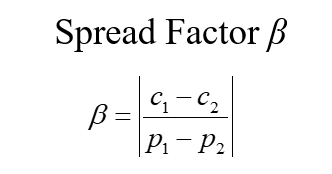

# SBX（模拟二进制交叉算子）定义

## 什么是SBX？

SBX（模拟二进制交叉算子）是一种实值交叉算法，它用一点交叉来模拟二进制编码遗传算法的行为。

## 为什么不直接使用二进制？

1. 许多复杂的现实问题都是有约束的优化问题，特别是对于工业工程领域的问题，标准遗传算法难以直接作为二进制字符串应用。

2. 二进制值表示的缺点：

3. 1. 难以达到任意精度的
   2. 汉明悬崖问题：就是在某些相邻整数的二进制代码之间有很大的汉明距离，使得遗传算法的交叉和突变都难以跨越。

### a.难以达到任意精度

（1）固定的字符串长度限制了求解的精度

（2）弦的适当长度并不是先验的

 

### b.汉明悬崖问题

移动到相邻解需要改变许多位，这给连续搜索空间中的渐进搜索带来了阻碍。

## 实数表示

实数（1.37）==>二进制数（10001001）

[注意]：10001001转实数为137

 

## 如何设计实数交叉？

1.应该满足什么样的约束条件?

2.我们可以模拟二进制单点交叉吗?

 

## 二进制交叉算子的关键特性

### 1.交叉前后解码实数值的平均值相等

### 2.交叉前后解码实数值差的商 ≈ 1

Spread Factor（扩散因子）：大多数跨界事件对应于β≈1的扩散因子。(也就是说，孩子倾向于与父母亲近)。

传播因子β被定义为子女与父母之间的距离之比。

 

（1）收缩交叉β<1：如果c1和c2解码后的值彼此变得更接近，则交叉称为收缩交叉。（子点被父点包围）

（2）扩大交叉β>1：如果c1和c2的解码值彼此远离，交叉称为扩展交叉。（子点包围父点）

（3）平稳交叉β=1：如果c1和c2解码值与父值相同，则交叉称为平稳交叉。（子点与父点相同）

# 模拟二进制交叉算法

- 其思想是操纵实变量，就像它们被编码在二进制字符串中一样。但没有汉明悬崖、固定精度和有界变量的问题。

- SBX使用概率密度函数来模拟二进制编码GAs中的单点交叉。

- SBX服从于：

- - 平均属性:保留已解码参数值的平均值。
  - 扩散因子属性:大多数跨界事件对应于β≈1的传播因子。

 

## 反解出子代

如果我们可以随机生成β，我们可以得到很多不同的子元素c1和c2。

其中p1和p2是父母的真实值，c1和c2是后代的真实值。β是扩散因子

## 通过概率密度函数拟合β

参数n为分布索引；

更大的分布指标n意味着子代和父代更接近；

利用均匀分布，可以从给定累积分布函数(CDF)的任意期望分布中生成随机数

## 总结

1. 选择双亲p1和p2

2. 生成一个均匀分布随机数u∈ [0,1)

3. 计算β：（其中n是散布因子分布指数）

   

4. 计算子代：

   

# SBX伪代码

Input：父解P1, P2∈R

分布指数n∈R（通常更倾向于将n设置为2到5之间的范围）

output：子解C1, C2∈R

