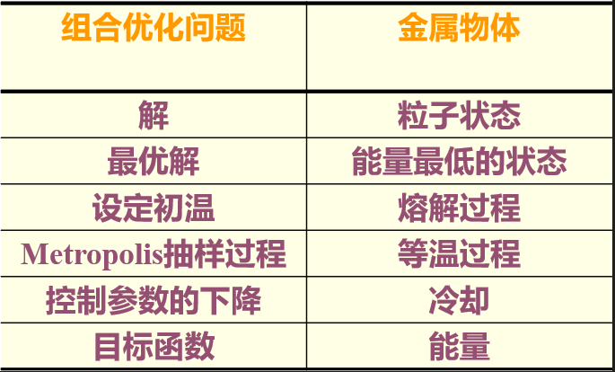
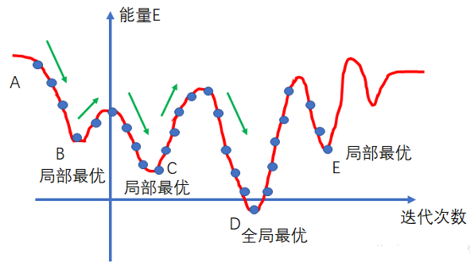
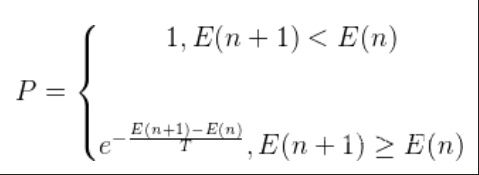
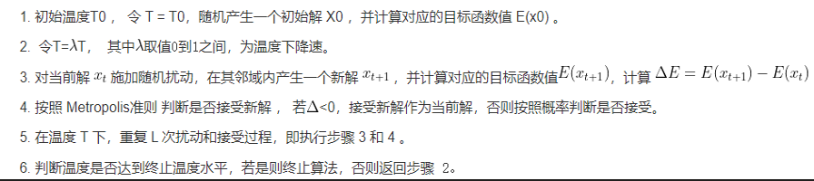
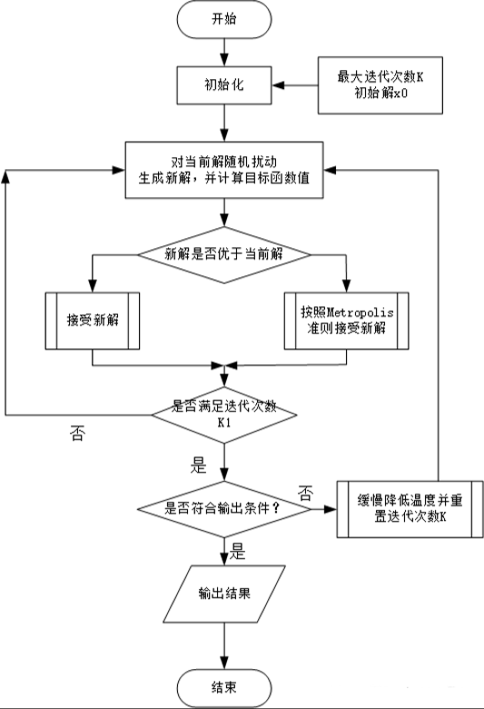

# 模拟退火（SA）


模拟退火算法(Simulated Annealing，SA) 它是基于Monte-Carlo（蒙特卡罗）迭代求解策略的一种随机寻优算法，其出发点是基于物理中固体物质的退火过程与一般组合优化问题之间的相似性。模拟退火算法从某一较高初温出发，伴随温度参数的不断下降,结合概率突跳特性在解空间中随机寻找目标函数的全局最优解，即在局部最优解能**概率性**地跳出并最终趋于全局最优。


【主要思想】：模拟退火算法是通过赋予搜索过程一种时变且最终趋于零的概率突跳性，从而可有效避免陷入局部极小并最终趋于全局最优的串行结构的优化算法。

【基本思想】：在一定温度下，搜索从一个状态随机地变化到另一个状态；随着温度的不断下降直到最低温度，搜索过程以概率1停留在最优解模拟退火算法是一种通用的优化算法，理论上算法具有概率的全局优化性能,目前已在工程中得到了广泛应用。


## 算法原理

模拟退火算法包含两个部分即**Metropolis算法**和**退火过程**,，分别对应内循环和外循环。

（1）外循环：就是退火过程，将固体达到较高的温度（初始温度T（0）），然后按照降温系数alpha使温度按照一定的比例下降，当达到终止温度Tf时，冷却结束，即退火过程结束。

（2）内循环：Metropolis算法，即在每次温度下，迭代L次，寻找在该温度下能量的最小值（即最优解）。


## 组合优化问题与物理退火的相似性比较




## Metropolis准则——以概率接受新状态

Metropolis算法就是如何在局部最优解的情况下让其跳出来（如图中B、C、E为局部最优），是退火的基础。1953年Metropolis提出重要性采样方法，即以概率来接受新状态，而不是使用完全确定的规则，称为Metropolis准则，计算量较低。




算法公式：

- 若在温度T，当前状态i → 新状态j；
- 若Ej<Ei，则接受 j     为当前状态；
- 否则，若概率     p=exp[-(Ej-Ei)/kBT] 大于[0,1)区间的随机数，则仍接受状态 j 为当前状态；若不成立则保留状态 i 为当前状态。 



在高温下，可接受与当前状态能量差较大的新状态；

在低温下，只接受与当前状态能量差较小的新状态。


## 退火过程——控制参数

Metropolis算法可以调整 T 的大小，控制算法收敛速度。T 如果过大，就会导致退火太快，达到局部最优值就会结束迭代，如果取值较小，则计算时间会增加。实际应用中采用退火温度表，在退火初期采用较大的T值，随着退火的进行，逐步降低，具体如下：

1. 初始的温度T(0)应选的足够高，使的所有转移状态都被接受。初始温度越高，获得高质量的解的概率越大，耗费的时间越长。
2. 退火速率，即温度下降，最简单的下降方式是指数式下降：T(n)     = αT(n) ,n =1,2,3,…；其中α是小于1的正数，一般取值为0.8到0.99之间。使的对每一温度，有足够的转移尝试，指数式下降的收敛速度比较慢。
3. 终止温度：如果温度下降到终止温度或者达到用户设定的阈值，则退火完成。


## 算法流程

算法实质分两层循环，在任一温度水平下，随机扰动产生新解，并计算目标函数值的变化，决定是否被接受。由于算法初始温度比较高，这样，使 E 增大的新解在初始时也可能被接受，因而能跳出局部极小值，然后通过缓慢地降低温度，算法就最终可能收敛到全局最优解，具体流程为：








## 伪代码

```
//初始化
J(y)：在状态y时的评价函数值
Y(i)：表示当前状态
Y(i+1)：表示新状态
r：用于控制降温的快慢
T：系统的温度，系统初始应该要处于一个高温的状态
T_min：温度的下限，若温度T达到T_min，则停止搜索

//算法开始
While(T>T_min)
{
	dE=J(Y(i+1)) - J(Y(i));
	If(dE<=0){              //表示移动后得到更优解，则总是接受移动
		Y(i)=Y(i+1)  //接受新状态
	}else{
		//函数exp(dE/T)的取值范围是(0,1)，dE/T越大，则函数越小（因为dE<0）
		If(exp(dE/T)>random(0,1)){
			Y(i)=Y(i+1);  //接受新状态
		}
	}
	T=r*T;    //降温退火，0<r<1。r越大，降温越慢；r越小，降温越快
	/*
	若r过大，则搜索到全局最优解的可能会较高，但搜索的过程也就较长。若r过小，则搜索的过程会很快，但最终可能会达到一个局部最优值
	*/
	i++;
}
```

