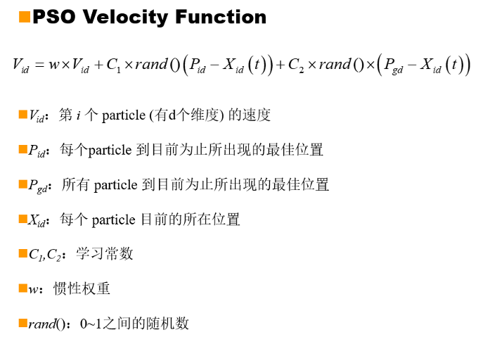

# 一、群智能（SI）算法概述

- 任何一种由昆虫群体或其它动物社会行为机制而激发设计出的算法或分布式解决问题的策略均属于群智能。
- 无智能或简单智能的主体通过任何形式的聚集协同而表现出智能行为的特性。

 

**定义群智能的5条基本原则**

- 邻近原则(Proximity     Principle): 群内个体具有能执行简单的时间或空间上的评估和计算的能力。
- 质量原则(Quality     Principle): 群内个体能对环境（包括群内其它个体）的关键性因素的变化做出响应。 
- 反应多样性原则(Principle of Diverse Response): 群内不同个体对环境中的某一变化所表现出的响应行为具有多样性。
- 稳定性原则(Stability Principle): 不是每次环境的变化都会导致整个群体的行为模式的改变。
- 适应性原则(Adaptability Principle): 环境所发生的变化中，若出现群体值得付出代价的改变机遇，群体必须能够改变其行为模式。

 

**SI的核心思路：**

认为人的智能是源于社会性的相互作用，文化和认知是人类社会性不可分割的重要部分，这一观点成为了群智能发展的基石。

 

**SI的意义和发展前景：**

- 群智能的思路，为在没有集中控制且不提供全局模型的前提下寻找复杂的分布式问题求解方案提供了基础；
- 群智能已成为有别于传统人工智能中连接主义和符号主义的一种新的关于智能的描述方法。

 

**广义的群智能算法包括：**

- 粒子群算法
- 蚁群算法
- 免疫算法
- 细菌觅食算法
- 混合算法

 

**群智能（SI）算法和进化计算（EC）的异同：**

- 相同点：

- - 都研究个体与群体的关系；
  - 都存在个体之间的信息传递；
  - 都是为了解决实际问题，而非单纯的模拟自然现象；
  - 都属于随机搜索算法；

- 不同点：

- - SI模拟的是个体之间的协同作用，而EC模拟的是适者生存的自然选择机制。

 

# 二、粒子群优化算法

 

**概述**

粒子群优化算法的英文为“Particle Swarm Optimization”，通常缩写为PSO。该方法可以应用于复杂全局寻优问题的求解。

 

**粒子群算法3条规则：**

1. 避免与相邻的鸟发生碰撞冲突；
2. 尽量与自己周围的鸟在速度上保持协调一致；
3. 尽量试图向自己所认为的群体中靠近。

 

**粒子群算法的产生背景**

- *复杂适应系统（**CAS**）*：

- - CAS是指其内部的成员(Agent)能够通过与其他成员以及外界环境的交流，并根据学习经验调整自身的结构和行为，进而实现整个系统的演变和进化的系统；

  - CAS的特点表现为：

  - - 主体(Adaptive       Agent)是主动的、活的实体； 
    - 个体与环境(包括其他个体之间)的相互影响，相互作用，是系统演变和进化的主要动力；
    - 宏观与微观有机结合；
    - 引进随机因素的作用，具有更强的描述和表达能力；

- *人工生命（**AL**）*：

- - 人工生命是对具有自然生命现象和行为特征的人造系统的研究，是一门涉及到生命科学，复杂性科学，人工智能，计算机科学，经济学，哲学和语言学等多学科的交叉学科，其研究模式主要体现为两类：

  - - 如何利用计算技术研究生物现象；
    - 如何利用生物技术研究计算问题；

 

**粒子群基本概念**

| **最优化问题**               | **粒子群算法** | **鸟群觅食行为**                   |
| ---------------------------- | -------------- | ---------------------------------- |
| 解空间                       | 粒子可行空间   | 天空                               |
| 候选解                       | 粒子           | 鸟的位置                           |
| 候选解集                     | 粒子群         | 鸟群                               |
| 解的搜索速度                 | 粒子速度       | 鸟的速度                           |
| 目标函数                     | 适应度函数     | 找到食物的可能性                   |
| 单个候选解搜索过程中的最优点 | 个体极值       | 某一只鸟记忆中最接近食物的位置     |
| 所有候选解搜索过程中的最优点 | 全局极值       | 整个鸟群觅食过程中最接近食物的位置 |

 

**PSO算法流程**

- Initialize(初始化)：

- - 将族群初始化，以随机的方式求出每一个粒子（Particle）初始位置与速度

- Evaluation(评估)：

- - 根据Fitness      Function（适应度函数）计算出其Fitness Value以作为判断每一个离子的好坏

- Find the Pbest（个体极值）：

- - 找出每个粒子      Particle 到目前为止的搜寻过程中最优解，这个最优解我们称为 Pbest

- Find the Gbest（全局最优解）：

- - 找出所有Particle      到目前为止所搜寻到的全体最优解，此最优解我们称之为Gbest

- Update the Position(更新位置)：

- - 根据      Velocity Function（速度函数） 更新每个Particle的移动方向与速度
  - 回到      Evaluation 继续执行，直到符合终止条件为止

- 

- 

**基本粒子群优化算法流程图**

**PSO Velocity Function（速度函数）= Cognition-Only Model（个体认知） + Social-Only Model（社会行为）**

**粒子群优化算法**

- 流程图
- 算法描述
- 

# 三、总结

- **优点**

- - 粒子群优化算法是目前群智能算法中发展较快的分支
  - 粒子群优化算法与其他现代智能优化算法相比，最大的特点就是收敛速度快，尤其在处理连续空间的多目标优化问题上有着非常明显的优势。
  - 粒子群算法思路简单，易于实现，有很大的应用潜力

- **缺点**

- - 快速收敛带来的早熟问题
  - 如何保证全局搜索能力
  - 算法收敛性分析尚不成熟
  - 离散化PSO缺乏相对稳定的算法模型

- **PSO与遗传算法的比较**

- - PSO和GA有很多共同之处，两者都随机初始化种群，而且都使用适应值来评价系统，而且都根据适应值来进行一定的随机搜索。两个系统都不是保证一定找到最优解。
  - 不同点在于，PSO没有遗传操作例如交叉、变异。而是根据自己的速度来决定搜索。粒子还有一个重要的特点，就是有记忆。
  - 与遗传算法比较，PSO的信息共享机制是很不同的。在遗传算法中，染色体相互共享信息，所以整个种群的移动是比较均匀的，向最优区域移动。