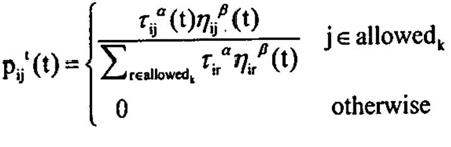

# 一、蚁群优化算法简介

蚁群算法（ant colony optimization, ACO），又称蚂蚁算法，是一种用来在图中寻找优化路径的概率型算法。

 假设蚂蚁每经过一处所留下的信息素为一个单位，则经过36个时间单位后，所有开始一起出发的蚂蚁都经过不同路径从D点取得了食物，此时ABD的路线往返了2趟，每一处的信息素为4个单位，而 ACD的路线往返了一趟，每一处的信息素为2个单位，其比值为2：1。

​     寻找食物的过程继续进行，则按信息素的指导，蚁群在ABD路线上增派一只蚂蚁（共2只），而ACD路线上仍然为一只蚂蚁。再经过36个时间单位后，两条线路上的信息素单位积累为12和4，比值为3：1。

​      若按以上规则继续，蚁群在ABD路线上再增派一只蚂蚁（共3只），而ACD路线上仍然为一只蚂蚁。再经过36个时间单位后，两条线路上的信息素单位积累为24和6，比值为4：1。

​     若继续进行，则按信息素的指导，最终所有的蚂蚁会放弃ACD路线，而都选择ABD路线。这也就是前面所提到的正反馈效应。

 

- 自然界蚂蚁群体在寻找食物的过程中，通过一种被称为信息素（Pheromone）的物质实现相互的间接通信，从而能够合作发现从蚁穴到食物源的最短路径。
- 通过对这种群体智能行为的抽象建模，研究者提出了蚁群优化算法（Ant     Colony Optimization, ACO），为最优化问题、尤其是组合优化问题的求解提供了一强有力的手段。
- 正反馈效应：某条路径上走过的蚂蚁越多，则后来者选择该路径的概率就越大，蚂蚁个体之间就是通过这种信息的交流来达到搜索食物的目的，由于其他路径上的信息素会随着时间蒸发，最终所有的蚂蚁都在最优路径上行进。

 

| **蚁群间的通信**     | **启发式搜索**               |
| -------------------- | ---------------------------- |
| 自然界蚂蚁觅食行为   | 蚁群优化算法                 |
| 觅食空间             | 问题搜索空间                 |
| 蚁群                 | 搜索空间一组有效解           |
| 蚁巢到食物的一条路径 | 一个有效解                   |
| 找到最短路径         | 问题的最优解                 |
| 信息素               | 信息素浓度变量（正反馈效应） |

 

蚁群优化的本质在于：

- 选择机制：信息素越多的路径，被选择的概率越大。
- 更新机制：路径上面的信息素会随蚂蚁的经过而增长，同时也随时间的推移逐渐挥发消失。
- 协调机制：蚂蚁间通过环境中的信息素来协同工作。

蚁群算法的寻优包含两个基本过程：

- 蚂蚁构建解：通过使一群蚂蚁并行异步访问邻近点，逐步建立优化问题的解。
- 更新信息素：依据蚂蚁所构建的解修改空间内的信息素浓度。

 

​    在TSP问题的人工蚁群算法中，假设m只蚂蚁在图的相邻节点间移动，从而协作异步地得到问题的解。每只蚂蚁一步转移概率由图中的每条边上的两类参数决定：一是信息素值，也成信息素痕迹；二是可见度，即先验值。

​    信息素的更新方式有两种：一是挥发，也就是所有路径上的信息素以一定的比率减少，模拟自然蚁群的信息素随时间挥发的过程；二是增强，给评价好的边增加信息素。

 

蚁群算法特点：

- 蚁群算法是一种本质上的并行算法，每只蚂蚁独立运行，仅通过信息素通信。
- 蚁群算法是一种自组织算法，自组织就是系统从无序到有序的变化过程。
- 蚁群算法具有较强的鲁棒性，求解结果不依赖于初始路线的选择，求解过程不需要人工调整 ，参数少，设置简单，易于应用到组合优化问题。
- 蚁群算法是一种正反馈算法。

 

缺点：

- 需要较长的计算时间，容易停滞
- 所有路径的信息素增量，会导致错误的引导
- 适用小规模的系统

# 二、蚁群优化算法的实现

## 相关参数：

- 表示蚂蚁k下一步允许走过的城市的集合。蚂蚁具有记忆功能， (k=1,2，…，m)用以记录蚂蚁k当前所走过的城市，随着进化过程作动态调整。![img](data:image/png;base64,iVBORw0KGgoAAAANSUhEUgAAArYAAAAzCAIAAADtg9z5AAAAAXNSR0IArs4c6QAAAARnQU1BAACxjwv8YQUAAAAJcEhZcwAADsMAAA7DAcdvqGQAACXxSURBVHhe7Z0PdB3FdfBHpYrMae0vhyBRjmMBfYoFlvkXWw5YPiRPwSVOG8e0qTlgqEQttY0/NX3KiUkxn0jAQNPiE704ak2PXoR8MIlJSXEE2K0p74HR44/lP7W+yq6MFPwJTJGNVBBQjBSOvnvvzO7OzM7u2yfJIJn5nbW1Mzt/7vzZe+/O7HuvYHx8nFksFovFYrGoWBfBMkMpEH8tFkskrKq35M1viL8Wi8VisVgsEtZFsFgsFovFYsC6CBaLxWKxWAxYF8FisVgsFosB6yJYLBaL5RNMf2pZQWNGBCwKn2AX4dQr/7Lhus/OKTgD50amsWBWyedvTe07MSZiPglkWEGjOPXTWMAKwo9lrF+kRSB9ygn78y5LiUuIv95+tkzKLoBkAZERj8lPU7lRIfSnQntS7ShMrMaEEFJyppGF3IipZb6r1HVanLmBQRMD4pexTIj8xiGTiS4DAa0QM4dmiDKLgoFcOcSIDmiGZU5JcK7jXkPgutbnaEmVJByMDsOQBQm3y3A1TFKBV7ScPhh/STm1P7VOTqXIjYEI9c5gPrEuwsiuhktWvbj80f98f7w5LuLOGOLNoyezTWfdXfmHW8/kyZsPzeNsPPzoZDGRVkfLm06IeAOk+jMxtrWV1deg4Qk3tyyulAxHXytjVaxPjeTHRKZpkHUMBgQua2d9zSLoZ2UlK5PKzLSzxMbArotOHGqsDvMSNDIdrKpV6ROQPJlgdXmKUlrH+mqVFnnEcaz5OBrJSwa4VJ9l2Xq09wVlLMucc/cweSrgOdUz1hoqxgSJN48rhM5rMouxOprXaBEVOwkk0qIUncBSMy312cTKwEkNddW2l/E6dEkFAUUHOBRkyEVJkLOqtY9Oc2j/TGNZfWUaUpkdpoKyno3jnfnOuZkFddPE4CNUfv8hQ2gqmPoSJaDw4u+/JALE0PP3frG4iLGi4iu/9fjAqIjVGDrQunpe4O3wsWEUq6+1isXbXhGh08zbj9+Co7Vq+xsi4jSDpjQKAeY28OiDHAqJNJnthJeG9Aue+GVIj0NC1tqHV6H3eV6eeDyNCfilkCPERZjIAZVKkvtVqiaP2zT34K2QY+CAckQkNcqIKDk4gUASDzsf2u4bAgVTAi5zYOvUTvAOiJe7OrxelfQEZFB729ix2gFpAJhU4nwSE8M3V0FboIKQlAYNPtpNjFeARMpFntcxsv70GiJhrmQSjlRurUaUq7JAGlSx1FB/uZhCScBRkzkhpx3iUkDeMwaYPZOgd8uSokTasaZqaCqY+hJdfJOkLV506f95bnB0dHB3Yh679P5DerWjg3vuvWo2TI0lW3pF1HQgRCy9jRNh9Pk7iqPZ/dHd6yZfXR4oGhCPIEuQ10Gq37X0dPfrhpNHwolwHXi9Tkb3Kj8gr2xNZSNhPE63ixAigCY5P8AeQxPkQvBwisUrThZjdu0QPeaLz3kohTtdzYN8dPxCYmPTmNIlAe6aODWg+Ub88IZPO6LLAB0O3QXyh9RNKENDswVwq4ADOkGLiX5QzzuWXlg1HhC3k2TqvMvwvwjohpBf5OjXFNRKBKE5IqMUjUUCvlIpXpfAzSly+YFyIJEfyKYJb2zgGcSkNhrGjvceWnHVgkJTaCrAEld/edEUlujxmbnl+44eFwHGuh/728yKOxqWlRQWlixvuLPq//7dYwfFJc6bTzZ9d2BV5iBMj8LfPEtEfvyEidXf38V+93eKRWhCnHp9x5ZN51Rdcp4IhzE8/Hrx8ss+wiU3/RWBasaSagzt4OJSvxoZcqQGROEy0I+VkdsVq2Rd0opwR5JVlIpzD9qPgOqCqIm8UT0l8N3u+ixLVntdwY+yMladFB3rrbPG2Xgzg3AywaZmm4429eEQrc7k2fx2FDLt3xwpZZ1gIB2HhovqmViy3K431llHWSZMkAwwUatZupNVqE4A2RkvCIe7XI0TGyYzySz3bl0n5qqGq3luHplB/VAZizixYzSv3Ymd6UhWKfM6WS3W83Vw9mjg4j3ONZFCge/r0xo+EWXnydn0QEu9skN5NQCrgm4P3AqI1XWiGVStvvAbTNsb6cr2jKoi8urFmUgkF2H4YOrWhXMKCmaVfOm+hzd9ZcMeEX9k/67Lr7vSMR9qaOzVp+77Q8xEuV4YZuzoA1+AUPWDx/j1p/63M5Z77yqBCzf84k2Kf/WpDV8qmVVQMOfq+3706MOLr7lkDkZPORdevOSDff1cFsaO7d/ZW/S584XweDucfLbHuUic+/s/eHDNglkiNGFOHU59vWTWrOsfOT726hN/Bf0zq+y2DHTORAkTa6Anu2Tp/Il33+Aj1589d/VDH/SuvxzGp+SuvRTrDdDCW1OpxjViPNlY955da5Z+9rn7roZGlXx9Gw7tcGYDNHHOut0jPE33posL/uQJEQgFKgREIAD99QLHEsgHqIZYnR6JBz2l+R/I6vzmnNDMvMHqO5RWsGyPOEcjWsXiPv3RWMayZJzMZNnGPsbq83gN0A+3+prbBNq6vswL8gNuQrA9bg94pkt9UIbH0OpGp9gCemmAOwrBZBq9WvgB+trvxsGRoXcyvMe2OKttz+O9BFaL2fP2VUoNiwqa3wkGTnebgsxzsAwwUXm83Pl+hwy1IblKMEwJ6ApTR0Gu1lafxzZhVDOvBxVKK6qyPY51RA+hVpnXgWsC+rN4phG9BnNyNy233NIjvuczSAjvoz/T7r3UAHbd9QcgU3UykY7wqgCoSqntEOIn/rcaOlZ21sXjtVWefwPeTsgbFWcAuV2EsaOpb1x991kbD70/fuo//6r75vVnX17Or/Tv3TH81c/P5wE1NJy5repr/7a0vW90/P0DTb++49a2bjZ/7QN/U85GP/yQUhx8/p9AldKUW7Lh4XVFa2uXnyvyvfgHOwdGx4f+4TdS/8AiP5Ya5xDH8MLp2ImXnn5m3hcr5orwhx+OssXznRAuMbiCTiXvpu/fdkHrM8nLs3tS928ZS+wb2r22//6OQ+LyFHPeRZce2v3iK6dEMG/Ou+Ex3DwQGxgnvrcE4uQBeqh8U/3D8ysu5KlhQK99J9Py5o2ZoWMPLO6457Hul9vu6b35hV+se6d74CQlGTyS7Y3HF06Fzwc3r6c3xWFaRYDDszQB7+5BUeHaFjSGptwhGPSYG4uzqqQoEF9nq9Vf5QMrC35DX/DbkWC4SmP4+Au2oEySzTXPuY9lLO5a/TQ8XdGJavLhAA0MQU2BQmONhgI9rWbhTHDVrS3P6DZvGStt9uoSh/rg7h5+FVu3lXVVh73Gjw/TdLiPqdA/UbwKNyOmzTJUQeonUORnfTBa8rM+LtdL5CtD7lUE5/XVZn/XOUed4/JO1i6BJczWlwklSbYOgwZtScTQMHY481r3EKKtIqCSbqpIQ9PNyeW0fnxuhfAoVPvuIhYQJrbK5RYo7SG4HotYenA58953l8npIhz/5+829N3+6JbrL4JH1XM+fT6r+v3F/GF75Mie7FcWXUznWmjvj29ILvzJQ99ZXFLIZi1YWMl6jw8xVrhw0ZcZX90fyfzsl7PmsdFf04fyXj4ydM+3rp3Dxvb+uMbNVzjn3HOL1lxzJSaIgD5sEj4vsj8VP++GQ9/Z8e0lAXsYv/VpcFdOA79d3XTf8pI3f3Xo5KHzvnEXdSlohcsuooseAa/kInk8WbEF3/qXR85O/O612j2fT+lg94s9L5AGaMuiraYB6t7zs5H/uaoWG1V4wQXlOOKf+9Mf/sWC/+rfV7R0Pg3A2OEXd5V/dZFwKcLhIycCBuBhQShKfoC2AEMIKsO/MODewKkmllgpzmVWJvD5WAZUPygr8APA7AH+T0M4yoKcEu6a0DvqSIzVVrEmcCD6WVOS1arqo70GX1AP8w8kwB7js7vj5cjP+jkOt3zwiqp1GThgzNprfWamn3VBC6IIh7ecUqlu82QZJrAcQp8KaQ+e7u5Au4+e0D+s2nHdghuCGclbgioqIWE/S9WwbP4fhQDylSF8FcHrJWcfKujIQwnIgF0GIwx+AK7z0z2kIT2287TwP08LkI/QBMqkP9Xk8xAClgUAt2vQZtPr/2h8c6wiREOsGMgLBw7RFxCQkM0CyYlyegLKlvwoVKf5aOUZRy4XYbBz+44Lv3W9sKXd+3e5281j+5/+ufdIqITAXJxcVXOteCgfPHGMlc/9DJwV/q+S4g/G4OG8/+cbj333b/6IHfp/4MMPP9H+xro/uwxqOLjr71+9Zd3XeD70ObxXG8iuBTm4+RKry4zs/r3U0rpfDIoYxFtGo5Wm4tm/LUJTTPfeDrb2jpvmY8vABBuMpv/edcnHYT28+Sv1n/7pYEa7TfIo/eiBnSOyl4YDtHrtCsMADR7JHvtmUw01iu444fgMHvzXvauvuQJPcSeKrVh0CZ1P6YBmGllTBe4lN6dZtaNn+TKDWwF+5IyxBlP3xZtZIqk8/IHqB2XFn/mCely8nZBQNjh42rqN+Hm2xhYowmR4siwTudlohtNoSyaghPApvxrb4tOfaIHAPzDsvg/gDohpEWHi4AZ2peQSZXFpxDN4wd4DtD3f9wPAmauEnvd3Vhc2GUbEax2dVFSR05Y1v0MwMYJkUDw842qK7Dia1lrw4M7NxAC7TK40PRcHz2sSgqcVlpynjdVtTGTrWxpb4OF8K59TfO0WbWfYKgI3s8v6Gz6q523jAgLKqo4KxqAKCvv4pWkVQcAb31TR91E16+Mhl4vw7jsn2Zcv52p9+Kl//LveP14qLAYo/As966aEho73sgtLxMb+8X/buqP4xmsuw/PPzJ3Pjp3ofmTDo7dsuqGyfMmbb703/MTGp5d/5xryLd5766SzeT529Kc/eGiJ92pDvDmdCH0Zjo+XEYMhKpw976LYB0VFZ4twbP7SIu9tnOOv97LyaO/o5Q+utq9Y/nlqJfhSTHTNaeDd/36DlZwDz/sTBe278gJq4ACNdD25w32x9PCTm7OXrvoCTgaMF57j8K7Nd/d6peUYUD5yIhAKPA2DFhIPynH6jDvZnpWkUsW9289qUK9JKlgFfAthhmmF373jwcqmfG87wjMi36zka+8C2kUWGog+T5/sYlt9Fq52K16Cp8k8nCNafM5bCWVw4x/8Ay8jNY014oJHZdpsfVNNhp0RAf/KBxHIA7QoDeIc0YxftAWV6ICFVjQ2iF2Nf7eOs4YKx1kBTwjj8N3SbBYMYf7dG4omg/+dDFx50lwlOibQvRGhuerK1J9qTKX01cRlqYwzrzu9tPJTMt60yWSX4yDwlFFRnugnstFgAqTzqfdMY3WyypPRwX3DAEwF91tqYFLAbYCLIq3GhwfAsIoAUCxmh2bFM7rrcWaRy0U466xPsaf3/8fY2Il9D/4y887Ikkvn/vdTGzam38UX/K6I/c7R1J+39PDX/bzQeRddyrr+4/ApBrk23bI2fUvbX+I+NmOlF1zOjty79sHlm2+OsU8V/VbvjsRf7lnZtPwcusrOKiza+0zPMDv1yhOpX/Yytjh2/uEHvt32Ml7r3r8LvRPuCTivzknks9GA9O7fJb/Ld/U3bp+XvbvlqRPQ0qc23Z5eddeNaLkdP9Plw1+PsX09A6YvLcR7SaT1TkleeQKh0XTcD/QW5s/99KtPfL9tkq8jGMW6eNFX9Jcu8wP9w6JPFeIorrn/AEQEDtC/7/k5G33/1Bg79fozd91821vrW2oXYAkn3/gVm0UlbN703OzLwHEsPLg5+SS+mJprQHPD98LZVnzid0FVSE9afO+APxKlagIe6F3IqGvbDUCmnbXjrodyBBlXgO/VgkkAHQQylJkekePNuCafn5cwAXyOBX+VAWwTxBsfe/hCi9+tEThmVUb7pkU/UCZu2UT72p8OUNzum54ElxmOoBWgMKpYKfgHqMiFI4Lf8oTeJ1po9IRoJwiSQck4l4LeQ5wMtFYBI+5OHj458W3EKvwYpPZJy3ybyB1TOPIzUf2Z9mQ7axD60cGkJ3FTAQy6M6/BiFfh3DU8ddFlSVliyG++HfLZaEB/xl3gVTHsENA2iN9BIKoqXgepcLuDwAb3p+jhQU6OhbqYVxEoVvSX8ioEtvpM8xdE8wMZSq+PFbHZFbXbe0dfe3T1bDb7uh8dGBoff/vZ9fNYUewmiIZUasj9FiI2e+7v3b5b+hqil75fXBRv5YlwQsxLpKEsh9Hetutms6LiL977/NDoS/fGiopi3xRfYvRKW3zV9tdGBl5ou/PO1szREa/ICQKVq1/KNNq7vbYCv18AZIb6eSTOCjFJXvnZjeXlczEBfrtSrLz8niwlccH5LdJ6pzSt5PsBe2D9s/xctNHptQkRIhZ+m5E0w/Pn7We/hz0Cg9+KQx48QId+tHbLrm03wUShxF2DTnvefvZ2iIQmbut5n+bI7KtE305yQHkPC8UK5630HQaI+6EG+swCRmyjL+RxtLB81d1L5geU80P4pxGQF2qU00IQZKqCAwKODCglXZJz8UtcWn4uH/hCXNAi8wQOaV1as0baweVROoTyejHS2jgkRiMHSB8hwUj1/TteAjSZv+WHbZcK8acECVGMnM2XGsXxN83fjXoMDQfID+0AsXHsqBAIumMEB8Rjo6QaRRvzl4F3gohx+kGJdA9f4RruoHBpsRBpIIwHHy4Zv2rgN1Ufn7UcTIR9k6BvdXAUGaVw8zumEyP6+pxIOnGKUjwCTB/oIshSidxULuSRL3HkkuCcEmhluGBheq1UgU8UL6VallObKr8SUi+dGcDsmQmI7+5jRWt3vi2iJslr21aw4lUPdofaptHn75gXbzPMt+nP+8czd1zK5n3/pUk7U6eFKRhQR/05+lTW7EGH0MhEuMl0D9AXvGTSJwJzXtUJEAeJp8SEHppdmfDhSpu7W0hsY4tA4cm4HgAvW3MISDsGx4SaPfyOI8fIyWNkhH+zoWsmSY/TObf6DlrDQWY3C69CJAidP1C41ihx5CMD7y6lhx0XQQQdGUQaCAbNAbVeKBmqiOIi0CFBEpNmc2cKYDSulMJ3Ba0h9A3lzmUVMVGAUUUkCeRq1HSymB5eekhtaJCMKqWQX4TUTE6pEEmnlBbh6fUKlFLUWs4A1HkzXRlNJ4pWbX8DzfqKba8NHXih5z1+YRKMDna11i6B5295Vqoc/ckN6+VVjhkDzNSi4pi6gDOtmIoBlXWfPT7Cg6yga6Xs8TEerjsVbTgspxfHpTijKIB/YpZNY7o3XfzX5z+9c83ZmcYrqn+yoG3f47fyd+ctM5OpGNBILzNaLBaHGaDqLdONmeEiWCw+rItgseSFVfWWvMn97YoWi8VisVg+gVgXwWKxWCwWiwHrIlgsFovFYjFg30WwWCwWi8ViwK4iWCwWi8ViMWBdBIvFYrFYLAasi2CxWCwWi8WAdREsFovFYrEYsC6CxWKZWdDPg0q/Iuj7QVaLxTI1zCAXwfe7ypZg6KdYwzHoVMilxUKnezFyILiCCEkIvX65ckNWJTlc12aC0UpgMb5IE3LdARirDM5ELdAvU2TAJMYGBMxuf9USpnxYjxYHUSZhg4qm5JkQy4tV5OqyKGA5gmWNjUpTdJGxpRz65X7tl/ylIJYBidWGyaXpJQuUNgWnMXYYYR5DIXdjxmuAjFKLVCtKE1yVkQCZVUISSY3D2gNQc0t5OOZOsMxUpr+LQPfV1Ey50Mmr3L+5b7RpREAPyT85FvLjapDbbW28oZXV1wS2PVa3tba9jFcVbxYlqcg/ghaQhJDTGdCzhiXnowqyObKHDjMnRxKTFoW+6ar2MkEJZfWVG9WfpcdiBU0VffSL8lKUiBwfb46L9BGJN6eZVHVOMh3JqtYGuRL8Ef2EJmxuSus6+2DAjRWDTIlsyFzJA5yYOEErVzZvTCSbUv3CPFUnVbsfq+ukySCAORHwq3rYv7F4bVd19C5DoNtYzk6KPhbuyJf1bHSk8v3KjzaxceRq4ySBfxA9fPY7j4b293exypi5kWrjjL9IJAT2JIBRSlaLc8yZaamvTOc7wy3TGDHyU4L4hd9V298QEZMHVYeYqtqvd+aH9nOePuC6d0dQ4hn1k1144+ougBzGFunXvW6Vm4oppbB2FfBymgi/6iGno+6WAUk1gd3kprTKRZ5XlA1XAsXBa24VkjgUX9WaVn7vPgJYlCY1YohyyFm4nI83CksLxpSAmuWvSWqtUTqId5Ig4fUqBDQ2CC6A20tuvZoAAojNgZTJLZSQCzQWrkX6g25ZUDBcCu8TJ68sBM/HzwVqLV4ouHC9BBlNZgBioqE1Tikq6JyACK+TTRXKVy0zj0guwujzdxRHs/uju9eFzuF8wQkn3WATm2+YEYXKowCsdyrbcdpx2uig3bh4WWk5XBfJ4ZLaUiXCdzUHXrm80hCUdCAcz6oE+HU3hXfGmycC3lUOvyjO5GJ0MCO/7FSHGeSi8kSXBDBEmYmcUEPNp4Z4s3yNoug0pPRItCpBDWMfQikTkVeDSgGp1SpQZBmfANQEg1AqXES9MBm3Bb7ul2ugEhIwOXkwEMMYylF47setBS/zgHsWrZk5S/YgcRKJ3IXymrWu4zGU2VRjVWsrdZRoblThLdOaCBsNp17fsWXTOVWXnCfCYQwPv168/LI81zODCV5s4wtd0fYDcIGyM99F1mkBtpJvCXOovdLStbe+GKvbmMi2Z+TucJf/ANyslcO4PBgEdJfXWwM9WXHmVRt1VVNbGFbQdI9O2Gqoj1isknX1u03HSVNRKgIeQn5ZeP/EwA0ObZHUt6irTzssWCpV6uZo0zMXjgCitExjfsW211QnE4aV31IaHRgH0uh0XbJuqno/zXdPf6ad1cYZHyBoXaYRp6dbv5gr0rzXNyE03A6C4YSG8V0ruUXeueiX/lQNvt5gAqvFHhxvrovF8hkLnta782iO6DZTtA3JtAgRUBjWujWfPhe3mtRGo9OQaSzDXYDm5o09vu0jt3vlC1rXafOA5gtcdP5m6+sZuHtd1dgrMIhd+TXCMi3J5SIMPnL92XNXP/RB7/rLYfaU3LWXYsdefWrDl0pmFRTMWXhrKtW45sFjFM3GuvfsWrP0s8/dd/WcglklX9+Gt89wZsPCOQVz1u0e4Wm6N11c8CdPiEA4uDloMhQwm0FFwMQUU9agxYGQuzcXWLGzJ/hxk61vYlvxRoWbkLSi2NrEezIp7baWVlSpPoKk8PnDgxTGzFGQTDXXQpLmUVS2Q4jrkSeamTdZfQdses+ACKCH4B86VI5Z1HNoE/ySmyyO17WKXnd6DgvR1SzidLPUw4pzhixLPeybsj4vjtOYITXtlRZvCHo9wEwtTB6/g5AL6FJx5qLfZdBnurx5iCUTi9ey+pYBmGDUzEwHS8OJOyBiTrkeJ85B3dQqdNYNqKY8F6511uhpWQbjwsS0AfIZC0pL9wufEs1xaIHubEEiHtWfauqqoj6nzXwvnTYvoTajujO1VNGdOF+hJ/l9BNWu7FDHi7pXcyxETd7dodZCw+9MAyy7tY8aOb6V1RRYB+EMIZeLcN4Nj+HmwZItvTjLT3xvCcQNZ26r+tqLf7BzYHR86KHyTfUPz6+4kKc++Pw/XftOpuXNGzNDxx5Y3HHPY90vt93Te/MLv1j3TvfASUoyeCTbG48vnEOBcNA+GSwDaXu46zy9RzejD/1ujArcFzDd83+56zRR5d5p8ZWom9wnwngD3M/e0zPoWc9QYtdNBQM92TDbrLodiFCfZqdNQtY6jnGXgHpl1QgDjsEghY9NT3ZwdWfyEMilBP3lzAjX2ASiqcpJInoJChWWrbNujX/KQtcZDJ/fuuOLmfxBLQDPcEMvE0HujIabkdLyyYRZ3boU+UBeefgn02XUpCanlngzNdqtzDPJCH/g1wynB2+mZsrDwUUL40ZLNplERROiSHKNRX+mHXyPrib6dEXgTYGfdaipr9y4sRLzgOzyoGtzAi4JdafOFxQyYO0Nh7CgoIYeNNKV9WVcXCwF3YTAuwrwKVavK/Aewg6u4n4NyUlXsZX4FIMvuqpOiGVGEmGjAex+8Vc/P1+E2NjeH9dsWbT1oe8sLilkhXPOPbdozTVX8kvde3428j9X1d51/UWzCi+4oJz1Hh/63J/+8C8W/Ff/vqKl82lyjR1+cVf5VxcJlyI3+oyHu42v+vk051RANxNZk9NUweTARzvNYntPz4S03j4VmJ/IwwClgorCp1sAUiiqvkM667BBYJ2414AP0wbdJFsgnhb+52kB8hHQxOCb+7rE7TX0IBii6HOh2CPH7Abh2FkvXYiTBfo0REMHQZ/eUHeVZDzD7RhJ0Of4qrqoKnAXhzLyjhabN2SPPwpvGerTprLX63KPw/NBe2Ui4P0Yo5fCDSSVIpfonjc2d3Th069IzuGPCVH0QOhY4A4KmtDKSvQjSt1JjYJK7lVzfKAn708BwL0JA4O7M+4M8jv05JVw54DPf7ixwEtwPohCtxk+8gc5Ck7ncbyKeHTHSigW/BpqChTTmIL4agYhaAv6ELjpYL2EGU5uF+HogZ0jrhMAHNz196+uXrtiLgVGjuzJrrhqQSEFBo9kj32zqWY+hVAPxS+7iOIP/uve1ddcgafsyP5dbMWiS+icT+AJqEjnidGByvGRb8FQCtgcVAuTsCbTCPeZEEBjKocVtSsBfeB1G9pbsy2JhKdePCWRrW8R53TVuwBaxnsqClKWQhaeVqhYnpZexahvaWzxb+KCF1HFtNc0AmaMh+t8EIpBcsxuAG5akc57mcOAbqwVXyRsBoP+zXOScttgWhUHrxtGokUyL3hC+1Y16CB8XJ9g03uSRg0MUGdDhd5RAnXUBM6SkTe91PPmxmalK2ligvHLMc4ewWOBWwa1tTBvVzZ3piuDfTocnXw7OQOOTQMYYlw7FCXj9qg7m/i8Ix9Akw7ilBjeQXIUdEFjh3y7IXJ/4HssECaNApqE/kLnJ+txACQ9U9ZeOz0ftizRyekioH13nQDkvbdOLlk6nzYKxo7+9AcPLbnuSv4i40jXkztWf3kRT3n4yc3ZS1d9AVcLMF5sLQzv2nx3r1cafrY6x9uN+mNx5cZOcMFhFsq6jm4EHwH3rRm4K/jqQV65ph3irsb1TVcHItpji3rDE9xoogYWHYD7OfAIlAxb0jbiuhlx/goFaOFS8d0LVa2t8DBL0BsVDaWYDnWUp0f6U/AwolvwZakMN7VKWpTZmQc4l5JJw/5nVe3WTnqLQ26HecZ4qM+jikEKcK4I0MuujuaaOHQdBkwIU97GVcYszxmcG2y0oq9p0vO3FRoqHGdF+DS4jJDNfiQOAvko1cnEyuCaULRMIz6gcnG0jhIYVxEIammE1RCYUTQxDY1G1yGvWwHfLvBGN97cGc84PrPqsRvcNgmj24hl82nl+QjoISh9KFw++S7RQxSWWoWDn6yGLljJjO/8SvhuIZ+OAWa2NrUgOV2Ed985yYo+VTh2Yt+mNfcfgIizCov2PtMzzE698kTql72MLY6df/iBb7e9zP59z8/Z6Punxtip15+56+bb3lrfUrsASzj5xq/YLCph86bnZl/GLiwpPLg5+eSbcKl7/64/Xnol3X3eu5AupKW01UcArAT3YMNvrQh4dz23qcGv10TUD3j/OWJRo0Qe+ZzQb9SpAG5v567GO921VTmAtKiFqrtI63LdiPLifk5nJzhkTLWuBNpxwysEiPtkHMP/qOWodoWyiDeTHgdVgjVREhUYiWQ7a+AaxsWkamiRw1lRgg4FF6/KJCtAtWpeQh4oBslxrlTHhkB/QNGrpn0PF5I/4rcPofpXbwXesdi3mpsRCRATCvBWoHH+JxjuTGM3gsS8c+njRFjTROZq5DkObj92rMEs0/2EEmGvgk1yk2h2U6CuIuBE5Cf0LVeRNid9XpSHe09FHYuBHu2btfjjOqJa03C5TG4jLk9g2dg/2GjwETI41QwTgaYgxkNanP7YwpUdXBlh9o6V9NIAHyjsMpSrmUmerfBljK6xKNRFWkFA3OHnAznlKs/yUSBmXiBvP/u9itmMza6obT0whBGjvW3XzWZFxV+89/mh0ZfujRUVxb75+MDo+KEfrd2ya9tNsSKeuGtwlPJjCbdDZFHspm0977/97Pp5bPZVkBWvvNIWX7X9tZGBF9ruvLM1c3TEyeEC6ti7QxzbwuGa2vw0EYBaAOAV7+h9BalwRZBgqBhRA9UmMsnniKoigsHytGxaUO0QHtCSIb4KnQapZSDUBiVKTsOvUl5DNYBbk0jpFeRUCVCJWpEy/mIxEcTKaTERlplISIXx0pz8Ihedi0olgUJwW6GITehhpcXKFapQqg7C3nW8iCFKRNG+ggUiBX2PgTGBDCWW8edwavbQY7DbQPIE/AHxHbl0+SCMjZNqlNrK45UIM6IUcWooxw+U7G8V4lVJQvE+Myf14RMXpZEi8Lo7CNHGgvCVixgj/T1sigGocVJHibCSkItL3zIi4o2FSyVI8gReANRi5JA/rYNIFZzAMo2Z0m9XzBPxZYysaO3Ot0WUjjdZTwPqbA8DJnfElNGAmqe6VV5jTHeiE4d/BYYG8asmyRyB1bJxdPxgwXhFpAuukmf3V+c1Ra7AIC+AKXxXqEpTMziSRGGIAlxp3GxOfZ50lBSCSp1uRgcowInAsrzEYQKRPXKS5pKcvoRIKtgTwZMVUMVSBacqZDH96QV6ezVyXHZwk7mSBzRSEzEIniztfTmQ0nIDoly3ehdfRrgMqZxEoVIAerlhcniD5B8ac+crQB1OKkkqtTVGAYxluxLLSOViprDG6CTwE6yYyViwZbrzMboIo+lE0artb7y2bQVbse21oQMv9LzHL8jgtIpwk0yE6DN2qud2tBs/H+zdN7XY/pwsUz/HLTMWvJ24tyAiLDOHAvhHo/fR073p4r8+/+mda87ONF5R/ZMFbfsev5V/GEIlj53ETyi2hywWi8VyGvgYXQSLxWKxWCzTlwhfnWSxWCwWi+WTh3URLBaLxWKxGLAugsVisVgsFh+M/X+br9JSq47AjAAAAABJRU5ErkJggg==)

- 𝛼：表示路径上的信息素对蚂蚁选择路径所起的相对作用大小。(信息素的相对重要程度)

- - α 代表信息素量对是否选择当前路径的影响程度，反映了蚁群在路径搜索中随机性因素作用的强度。
  - α 越大，蚂蚁选择以前走过的路径的可能性越大，搜索的随机性就会减弱。
  - α 过小，会导致蚁群搜索过早陷入局部最优，取值范围通常为[1,4]。
  - 当𝛼=0，算法就是传统的贪心算法

- 𝛽：表示相对于𝜏_𝑖𝑗的重要程度。(期望启发式因子的相对重要程度)

- - β 反映了启发式信息在指导蚁群搜索中的相对重要程度，蚁群寻优过程中先验性、确定性因素作用的强度。
  - β 过大，虽然收敛速度加快，但是易陷入局部最优。
  - β 过小，蚁群易陷入纯粹的随机搜索，很难找到最优解。通常取[0,5]。
  - 当𝛽=0时，就成了纯粹的正反馈的启发式算法。

- 𝜂_𝑖𝑗：为由城市𝑖转移到城市𝑗的期望程度（启发式因子）。例如，可以取𝜂_𝑖𝑗=1/𝑑_𝑖𝑗

- 𝑑(𝑖,𝑗)：表示城市𝑖和城市𝑗之间的距离

- 𝜏_𝑖𝑗：表示在t时刻城市𝑖和𝑗之间的信息素量.初始时刻各条路径上信息素相等， 𝜏_𝑖𝑗=𝐶 (C为常数) 。

- 在t时刻蚂蚁k由城市i转移到城市j的概率![img](data:image/png;base64,iVBORw0KGgoAAAANSUhEUgAAAV8AAAAaCAIAAACfNci9AAAAAXNSR0IArs4c6QAAAARnQU1BAACxjwv8YQUAAAAJcEhZcwAADsMAAA7DAcdvqGQAAAtHSURBVHhe7Z1viJxHGcDnhNhUbAKlpkg0+bBnjJxe0eYqZK/FXZFaLddE/Ftod8U9rHjgLmhBdLFyRqwVbj8cKO6Ce7XFpqDWtX/Ewq693iqXpWoPzpq4K/VspA2N1bMfDu7D+jzP/Hln5p333T93Tbdhfh9y78w8M/PMzDPPPPO+l2Ss2+0yj8fjCfEm8dPj8XhMvHfweDxuvHfweDxuvHfweDxuRss7dCrTY9OVjkh5PJ7Xkx15h/OnT6Z3cy93GtVmMptKiOSOQWdTaIiEolGI8kCWvC4IzzZGI1Bu9eT0dNhMX+4v3J5GVCHkT1caMR42rnvU1yik1mzZSL2ouqrgHDx170KX1NYAHsNtAFwEG4uYItIlavpICa3Qoaqmg4GcEW0cXA8dV0VSyDmW0WZ47/D7U+94z2cfacyOj42lf/K8yBwYmjfJ+GyTNbFBJ+FpNyr3Pf2puTKbXYywnShSC12Del4UOODGlcgtQT8Z1CnK2l4TDuVW2tnquLO/1EI93+Q69aTTaYU9daNWSk4cEglE7Y3x9XmYlpUcVmgUwiuJ+ohJbJeTLF+nRw7Ukhuvf6CxOks7K+HUJ0vpvqYcT6T8PKktaSzOsvJcSqTcJMttYQTBoCivu5Cy/QU3bJdlXzKjGBYa2nCs3vPOLzz+X5HYOTjXhtE4QMMKhHQzg9p8dTS0cqroBASgLolJ+ZAwZOp9Aao7l6xRyOsK3XCMITWBUCsOgnpSXxvVL6efRgVGc6ikSbJcd7WlOhPjJMJDxJygg0DWqsUraZnwaDYk0OshYX2jsJoLVcRWsXULyNZF83mhLGTyIvgzSlmEmowsHWF2cLNYW/7Zh04k94nUTulUiqWk5rEHP0wAy2ujyy6l8Wm6kVqh8cJSWsu04D4k+LKDrLCWjfWmdmrCwcqmEvLA0U0E04cmks31DXhI5FawfagbCEcC9QN4ewGQRni0lC7xYRUqZvAE+doBpcasY7crMCYBT0NTbiWXgpGEdgCPFHRAvzSrd5dYRqweKpxulduyAwgrqlmRwiO+5T7haSFh+Wg405WKsa7BshIFZsV1QMReDSscSPG161QyEDhoNcWSijkh+YUZEQjAfJMpoGHAGqMcgYOWxovPGbaEfTMre3D7vtQM7x2ef+bx/cePXHnhyZ/XXxZZO8AR4NnghFKIxi3DZVUiypPgynIbF2bRKIClLtEz2t8AgZ3pDnqQSEyxVkctfSgc5+B4IsYRCbqbYOvSJtM2MeRreyK8FeLBGZEGCyrnZzBE1i0Y18iaAzEGtV/xfgFagZp4u6GSqXqgCcy/4cB4PccM0ELKLU7VtYEFy0oYnq03pHLEpLeK6Bu4gYRAE1CQOuguXOAqgYOEuTPuWDgXOBacaHQYgy7QpaeXd9j6S+W2A3v3njx9fvufj37lvfvG9o7f3fg3llx59duf+9LkwdkX3nfjNSTqgExgTCRi4B67x1UP55w8ObcMt1FYBq0DZgHnGl8SNNN8fTC7sna4a8NLVPCAoHMIv2olu6GTaDDjjgO6FU8KtEQdGXZohHcKOVF9NXgrygcELCbQW4VWBeTF6Mx1srw3Uc+XaoM4SO58LYSXUkDvmhMi+jmpp+ZXIvcs+kaKGaz5gqABu1JuTxSDtUJLYsDCn7XnyGQwc/Q9AxLvHV6t3/fA4fLvStc1l5d+XNv/jT9dfPY7b7mv+Auc52tve3Czu3XhV58/socLD09jEUwJNpC+xuYhE7220lwpyoOZj3zliJ1o0ugb0OgjThEbYQMSYX1RWiVS2aS0eZdzQEcF96i2YSPGxrN3sRieAyVGI+FOCSdS6aadukHYIaB9bQMa87lXa1Cc4CelXpWgrU8zS3rIq05tBhtuVhtRGxIVFDMPe6UfB6lmn4+Lh2bGAlrjsoftJlhU9H0ENOpa1411lkzCZNYninJeaFG4AxD7HwgGQw3hJySKFCB/Y3EcW47oYASJ9w5vTRe/+5EDL//92c3/TX7uyzce2LNn8voPs3PnL4ryXuBs9fxbXhRuEjxu5phRcrSvlTYh1z/yMqu5cWwZfUNc/ADGzo2AW42oraFtLC4LfyoLI/dQBBOg1ymWc6hmxvFuaw/J2Hr2Vow0by7GlRE3GozEel3T4lBjVWuAqvLLhhDRwEAjn8e90S63ZqtZkG9PFGkmgq0HwIYIvD8WK7fWl4fmivBpEKEZLqD+qmoYAhtT65laoFuRUEq+b2rUWtksxiyHcitqXpQvoG/xQTDJB5pm5Ww1rU0EGVSmwOb4taufYb++9PHeYe1Mbd/X5269mieeeYIljx6m512B9mg+0vaHIJGbjwpWYdXERZjh6R13t4BNFxhBlJi4hXNZsZu5LCrRnF0s4Mcx6x4L1hJ7rvZFqwj2V1jUXpXiA26bagZ9w4C3pt7grTvYzwQ/B/FNztwEiqBzX8lt0K3CcG248dBFBt4fcwKRGF2rGeinUNNe+sADecEihV8R7wh2BugJnk7/WgpOvmUHgBACyP1N0ZO6S6J3BiODceXUgJUttbOsQzOFPYy6f+jtHV56rnn2U8ffT8/ba7+9/+wtn5y+FhPnfvTBoz9Yo3zizLcP2AETtyKRcIGzDuf4jEjuEs5gFf05vi+HInIScHpHWSUuXlDWqUDAbF3fMWTkL6kNWT3Sxd8tKJXkS1CNZHYJTh84ToYLL0F5jLWyS93u3ITcNeKNOW6bZnM3fYM49fDXN4K4jp+zGJ1AfG8MECYAv1Bg9CAnQnjkgS/a9GKmOTUPkcsME05QvhhEL9hsvka+gcDhGipnQ7EYLDCj/U3xIdw6JKb5WCRyC7yhWKkRoad32F5bfoRd/M8r22zrX7+5+9ZvXlMuffoglRy5a/WvX52kR+KGb10Y2ARgigaqQy+ktM8B/YImip4BOgMDRtdQngq2p9ObSCBoLFXZnNgXEpfWaCVwzeBhC+4TsBnmdgIQvZaTQzgIGAd9HqP+6TsPq+Huha7ovQ0qQME2CA4buWJVDnghFTxRLqmLE8i9rGbrAryUoGqwrrB1qBElGwtU1KcU+qjN8I4hUSslp9YhiKCgBG43/EUH3Z1AcDgnOwAYreRy5gjIa6ZZnhWn6aRZmudvSkGfY5ljNHADfksViYBRDx5wCeJYvedtyfyp2xNXMHbVRLb8x4s8my6Ad/xa/i7Uiw+dYOyKrz0lkoOiXeQkjixCXQ8hMFXPnJC8Gb/KukoMx2DUwQyQp7GZhFURlXVZFIJ0Em/h1JASVPVFLXqW6qOgNRInlg5YRc/imtAljY+BCuVPCaSt/qSepm6EXrkNqEqqjgBLjDxsCzCb0zDHq4s5m9IyeE2aY6gmpe1akKZGhR5AMBBsgMsGpQKjY8LoHRLYjN0CPcIT/LT1UIiqbzB6eQcYrnvTv/DALSceelEkgLM/vMFIDwTNXdleK4vwrOtroU0/LZlAVaIlDS0QrxVUcK9g0LbedKRsuESzJzeRViUJVBBARlDBGBwlYtSL7ccg1CkHh2i2ItUXXUeMVZUCoXapUY5eGepookbPokZUV+7xcy1EmTE+zOdt6Xoa7RvyRktaJac+dtU3CD3+5bjNR+/c/72bQq/X4cLRKNzcmaur/JdOn5x55d7Vu46ItMczmuCVj9V733U8Pd87/Hn5YXZuefVvmyKt+MMTDx5/91VPP3mGl2y2Hmt+7APeNXhGHHo14/wy6wnTwzvc9P2t7oX7b3+X/bcpNrde3Tr18TvPHpykks3lh3/60euPUpHHM4pAzADEfqvyWOzGv0m9fa5y8+RjX/zHLz9DXzo9Hs9lQR+/DRUPuOQ3HysdXrr3E941eDyXFf7/s/B4PG52HDt4PJ7LEsb+D+huHXkDwKdFAAAAAElFTkSuQmCC)

## 信息素进行更新：

经过𝑛个时刻，蚂蚁可走完所有的城市，完成一次循环。每只蚂蚁所走过的路径就是一个解。此时，要根据下面的更新规则对各条路径上的信息素进行更新：

其中𝜌∈(0，1)为挥发因子（1-ρ）为信息素残留系数，因为随着时间的推移，路径上以前留下的信息素会逐渐消失，用参数𝜌表示信息素𝜏_𝑖𝑗随时间的推移而衰减的程度。

- 信息蒸发系数ρ

- - ρ 反映了信息素的蒸发程度，相反，1-ρ 表示信息素的保留水平
  - ρ 过大，信息素挥发过快，容易导致最优路径被排除。
  - ρ 过小，各路径上信息素含量差别过小，以前搜索过的路径被在此选择的可能性过大，会影响算法的随机性和全局搜索能力。通常取[0.2,0.5]。

信息素增量 ∆𝜏_𝑖𝑗可表示为：表示信息素增量

∆𝜏_𝑖𝑗^𝑘表示蚂蚁k在本次循环中在城市𝑖和𝑗之间留下的信息素：

（Q为常数，𝐿^𝑘为蚂蚁k在本次循环中所走路径的长）

## 算法流程：

- 步骤1：nc=0（nc为迭代步数或搜索次数），将τ_ij和∆𝜏_𝑖𝑗初始化，将m个蚂蚁置于n个顶点上；
- 步骤2：将各蚂蚁的初试出发点置于当前解集中，对每只蚂蚁k（k=1，2….，m），按照概率p选择下一个顶点j；将顶点j置于当前解集；
- 步骤3：计算各蚂蚁的目标函数值Z_k(k=1,2…m)；记录当前的最优解；
- 步骤4：更新信息素
- 步骤5：对各个弧（i,j）,置∆𝜏_𝑖𝑗^𝑘=0，nc=nc+1;
- 步骤6：若nc<预定的迭代次数且无退化行为（即找到的都是相同解或进化趋势相差明显），则转步骤2；
- 步骤7：输出当前的最优解；

- 初始化：将m只蚂蚁随机放置。设定信息素初始值。

- - 时间t=0
  - 迭代次数nc=1
  - 每条边上的信息素τ_ij=C，∆𝜏_𝑖𝑗=0。

- 更新禁忌表：将当前位置添加到禁忌表。

- - 禁忌表作用是防止蚂蚁走重复的路径，走过一个城市，就把它的编号加入禁忌表。

- 确定行走方向：根据转移概率选择下一地点。

- - 求转移概率
  - 残留信息的相对重要程度𝛼和预见值的相对重要程度𝛽体现了相关信息痕迹和预见度对蚂蚁决策的相对影响。
  - 推荐参数的最佳设置为：𝛼=1，𝛽=5，ρ=0.5

- 求信息素增量：每只蚂蚁周游完一周后，计算每条边上信息素增量。

- - 信息素挥发（evaporation）和信息素增强（reinforcement）

- 判断终止准则：判断周游次数是否满足停机准则。

# 三、蚁群优化算法实例介绍

例给出用蚁群算法求解一个四城市的TSP问题的执行步骤，四个城市A、B、C、D之间的距离矩阵如下

假设蚂蚁种群的规模m=3,参数a=1，b=2，r=0.5。

- 步骤一：初始化。首先使用贪心算法得到路径ACDBA，则C^nn=f(ACDBA)=1+2+4+3=10。求得τ_0=m/C^nn=3/10=0.3。初始化所有边上的信息素τ_ij=τ_0。

- 步骤二：为每只蚂蚁随机选择出发城市，假设蚂蚁1选择城市A，蚂蚁2选择城市B，蚂蚁3选择城市D。

- - 以蚂蚁1为例，当前城市i=A，可访问城市集合J_1(i)={B,C,D}。计算蚂蚁1选择B，C，D作为下一访问城市的概率：
  - 
  - 用轮盘赌法则选择下一个城市。假设产生的随机数q=random(0,1)=0.05，则蚂蚁1将会选择城市B（随机数更靠近概率p(B)）。用同样的方法为蚂蚁2和3选择下一个访问城市，假设蚂蚁2选择城市D，蚂蚁3选择城市A。
  - 当前蚂蚁1所在城市i=B，路径记忆向量R^1=(AB)【禁忌表】，可访问城市集合J_1（i）={C，D}。计算蚂蚁1选择C，D作为下一个城市的概率：
  - 
  - 用轮盘赌发展选择下一个城市。假设产生的随机数q=random（0，1）=0.67，则蚂蚁1将会选择城市D。用同样的方法为蚂蚁2和3选择下一个访问城市，假设蚂蚁2选择城市C，蚂蚁3选择城市C。
  - 实际上路径已构造完毕，蚂蚁1构造路径为（ABDCA）。蚂蚁2构造的路径为（BDCAB）。蚂蚁3构建的路径为（DACBD）。

- 步骤三：信息素更新。

- - - 计算每只蚂蚁构建的路径长度：C_1=3+4+2+1=10，C_2=4+2+1+3=10，C_3=2+1+5+4=12。更新每条边上的信息素：
    - 
    - 根据公式依次计算出问题空间的所有边更新后的信息素量。

