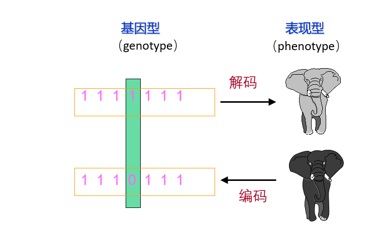

# 遗传算法（GA）

# 遗传算法的简介

遗传算法 ( GA , Genetic Algorithm ) ，也称进化算法 。 遗传算法是受达尔文的进化论的启发，借鉴生物进化过程而提出的一种启发式搜索算法。遗传算法是模拟生物在自然环境下的遗传和进化过程而形成的一种自适应全局优化概率搜索方法。

总的来说，求最优解或近似最优解的方法主要有三种：枚举法、启发式算法和搜索算法。

 

【算法思想】：借鉴生物进化论，遗传算法将要解决的问题模拟成一个生物进化的过程，通过复制（选择）、交叉、突变等操作产生下一代的解，并逐步淘汰掉适应度函数值低的解，增加适应度函数值高的解。这样进化N代后就很有可能会进化出适应度函数值很高的个体。

 

【具体步骤】：

1. 随机产生初始群体；
2. 判断是否满足终止条件，若符合，输出结果，结束；否则，进行下一步，计算每个个体的适应值；
3. 依据适应度选择再生个体，适应度高的个体被选中的概率高，适应度低的个体被淘汰；
4. 选择一个个体复制到新群体；
5. 按照一定的交叉概率和交叉方法，变异概率和变异方法生成新的个体；
6. 由交叉和变异产生新一代种群，返回步骤2

 

 

# 算法概要

对于一个求函数最大值的优化问题（求最小值也类同），一般可描述为下述数学规划模型：

其中：

- X＝[x1,x2,…,xn]T为决策变量
- f(X)为目标函数
- 式(1-2)、(1-3)为约束 条件
- U是基本空间，
- R是U的一个子集
- 满足约束条件的解X称为可行解
- 集合R表示由所有满足约束条件的解所组成的一个集合，叫做可行解集合

 

【说明】：

将n维决策向量X＝[x1,x2,…,xn]T用n个记号xi(i=1,2,…,n))所组成的符号串X来去示：X＝x1x2…xn ==> X＝[x1，x2， …,xn]T

- 把每一个xi看作一个遗传基因，这样，X就可看做是由n个遗传基因所组成的一个染色体；
- 这里的等位基因可以是一组整数。也可以是某一范围内的实数值，或者是纯粹的     一个记号。最简单的等位基因是由0和1这两个整数组成的，相应的染色体就可表示为一个二进制符号串；
- 这种编码所形成的排列形式X是个体的基因型，与它对应的X值是个体的表现型；
- 对于每一个个体X，要按照一定的规则确定出其适应度，个体的适应度与其对应的个体表现型X的目标函数值相关联，X越接近于目标函数的最优点，其适应度越大；反之，其适应度越小。

 

遗传算法中，决策变量X组成了问题的解空间。对问题最优解的搜索是通过对染色体X的搜索过程来进行的。从而所有的染色体X就组成了问题的搜索空间。

 

| 群体 | 生物的进化是以集团为主体的。与此相对应，遗传算法的运算对象是由M个 个体所组成的集合，称为群体（或称种群）。 |
| ---- | ------------------------------------------------------------ |
|      |                                                              |

与生物一代一代的自然进化过程相类似，遗传算法的运算过程也是一个反复迭代过程：

- 第t代群体记做 P(t)，
- 经过一代遗传和进化后，得到 t+1 代群体，记做 P(t+1),

 

这个群体不断地经过遗传和进化操作，并且每次都按照优胜劣汰的规则将适应度较高的个体更多地遗传到下一代，这样最终在群体中将会得到一个优良的个体X，它所对应的表现型X将达到或接近于问题的最优解X*。

 

| **术语**            | **说明**                                                     |
| ------------------- | ------------------------------------------------------------ |
| 位串（bit String）  | 个体的表示形式。对应于遗传学中的染色体（Chromosome）         |
| 基因（gene）        | 位串中的元素，表示不同的特征。对应于生物学中的遗传物质单位，以 DNA序列形式把遗传信息译成编码。 |
| 基因型（genotype）  | 遗传因子组合的模型                                           |
| 表现型（phenotype） | 由染色体决定性状的外部表现                                   |
| 编码（coding）      | 表现型到基因型的映射                                         |
| 解码（decoding）    | 从基因型到表现型的映射                                       |
| 个体（individual）  | 指带有染色体特征的实体                                       |

# 遗传算法的运算过程

选择（复制）： 根据各个个体的适应度，按照一定的规则或方法，从第t代群体P(t)中选择出一些优良的个体遗传到下一代群体P(t+1)中；

交叉：将群体P(t)内的各个个体随机搭配成对，对每一对个体，以某个概率(称为交叉概率）交换它们之间的部分染色体；

变异：对群体P(t)中的每一个个体，以某一概率(称为变异概率)改变某一个或某一些基因座上的基因值为其他基因值。

执行步骤：

（1）个体编码

（2）初始群体的产生

（3）适应度计算

（4）运算：选择、交叉、变异

（5）终止条件判断

（6）解码

 

# 实例运算

例、求下述二元函数的最大值：

（1）个体编码

遗传算法的运算对象是表示个体的符号串，所以必须把变量 x1, x2 编码为一种符号串。本题中，用无符号二进制整数来表示。因 x1, x2 为 0 ~ 7之间的整数，所以分别用3位无符号二进制整数来表示，将它们连接在一起所组成的6位无符号二进制数就形成了个体的基因型，表示一个可行解。

例如，基因型 X＝101110 所对应的表现型是：x＝[ 5，6 ]。

个体的表现型x和基因型X之间可通过编码和解码程序相互转换。

 

（2）初始群体的产生

遗传算法是对群体进行的进化操作，需要给其准备一些表示起始搜索点的初始群体数据。

本例中，群体规模的大小取为4，即群体由4个个体组成，每个个体可通过随机方法产生。

如：011101，101011，011100，111001

 

（3）适应度计算

遗传算法中以个体适应度的大小来评定各个个体的优劣程度，从而决定其遗传机会的大小。

本例中，目标函数总取非负值，并且是以求函数最大值为优化目标，故可直接利用目标函数值作为个体的适应度。

 

（4）选择计算

选择运算(或称为复制运算)把当前群体中适应度较高的个体按某种规则或模型遗传到下一代群体中。一般要求适应度较高的个体将有更多的机会遗传到下一代群体中。          

本例中，我们采用与适应度成正比的概率来确定各个个体复制到下一代群体中的数量。其具体操作过程是：

- 先计算出群体中所有个体的适应度的总和;
- 其次计算出每个个体的相对适应度的大小（例如编号1的适应度=34/143）     ，它即为每个个体被遗传到下一代群体中的概率，
- 每个概率值组成一个区域，全部概率值之和为1；
- 最后再产生一个0到1之间的随机数，依据该随机数出现在上述哪一个概率区域内来确定各个个体被选中的次数。

（5）交叉计算

交叉运算是遗传算法中产生新个体的主要操作过程，它以某一概率相互交换某两个个体之间的部分染色体。

本例采用单点交叉的方法，其具体操作过程是：

- 先对群体进行随机配对；
- 其次随机设置交叉点位置；
- 最后再相互交换配对染色体之间的部分基因。

可以看出，其中新产生的个体“111101”、“111011”的适应度较原来两个个体的适应度都要高。

 

（6）变异计算

变异运算是对个体的某一个或某一些基因座上的基因值按某一较小的概率进行改变，它也是产生新个体的一种操作方法。

本例中，我们采用基本位变异的方法来进行变异运算，其具体操作过程是：

- 首先确定出各个个体的基因变异位置，下表所示为随机产生的变异点位置，其中的数字表示变异点设置在该基因座处；
- 然后依照某一概率将变异点的原有基因值取反。

对群体P(t)进行一轮选择、交叉、变异运算之后可得到新一代的群体 p(t+1)。

从上表中可以看出，群体经过一代进化之后，其适应度的最大值、平均值都得到了明显的改进。事实上，这里已经找到了最佳个体“111111”。

【注意】：需要说明的是，表中有些栏的数据是随机产生的。这里为了更好地说明问题，我们特意选择了一些较好的数值以便能够得到较好的结果，而在实际运算过程中有可能需要一定的循环次数才能达到这个最优结果。

# 遗传算法伪代码

# 遗传算法的应用

- 函数优化
- 组合优化
- 生产调度问题
- 自动控制
- 机器人学
- 图像处理
- 人工生命
- 遗传编程
- 机器学习